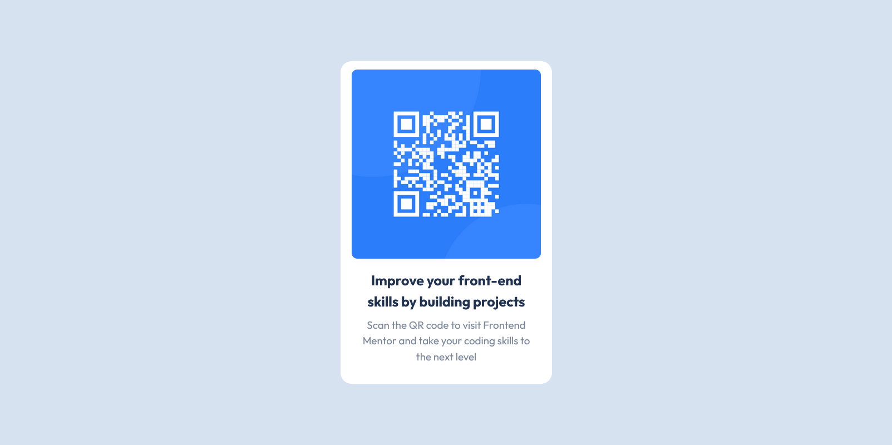

# Frontend Mentor - QR code component solution

This is a solution to the [QR code component challenge on Frontend Mentor](https://www.frontendmentor.io/challenges/qr-code-component-iux_sIO_H). Frontend Mentor challenges help you improve your coding skills by building realistic projects. 

## Table of contents

- [Overview](#overview)
  - [Screenshot](#screenshot)
  - [Links](#links)
- [My process](#my-process)
  - [Built with](#built-with)
  - [What I learned](#what-i-learned)
  - [Continued development](#continued-development)
- [Author](#author)

## Overview

### Screenshot



### Links

- Solution URL: [https://github.com/bulofed/QR-code-component](https://github.com/bulofed/QR-code-component)
- Live Site URL: [https://bulofed.github.io/QR-code-component/](https://bulofed.github.io/QR-code-component/)

## My process

### Built with

- Semantic HTML5 markup
- CSS custom properties
- Flexbox


### What I learned

Usage of flexboxes, setting up the root, usage of utility classes and usage of rem units.

```css
body {
    display: flex;
    align-items: center;
    justify-content: center;
    background-color: var(--clr-neutral-200);
    font-size: var(--fs-body);
    font-family: var(--font-family-primary);
    color: var(--clr-primary-400)
}
```

### Continued development

I still strugle with positioning, I'm not happy how I placed the content inside of the container and wondering another way to do so.

## Author

- Frontend Mentor - [@bulofed](https://www.frontendmentor.io/profile/bulofed)